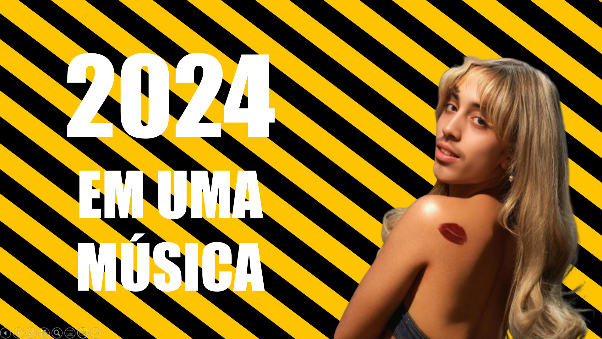

# 2024 em Uma Música

<p align="center">
  
</p>

> "Bom, fim de ano chegou. É hora da gente olhar pra trás. E relembrar de tudo o que aconteceu. Mas como seria o ano de 20XX em uma música?"

Se assim como eu você também sentiu a falta dessa frase em algum ano, bem vindo! Mas um certo grupo da classe de Criatividade Computacional se juntou e se perguntou, "e se déssemos continuidade a esse projeto, mas utilizando AI"?

E então nos juntamos e criamos uma coleção de como seria o ano de 2024 em uma música, utilizando o RVC, e ferramentas de edição e criação de vídeo e imagens com Inteligência Artificial, explorando ao máximo a nossa criatividade e dos modelos, para gerar uma coleção de músicas na voz do Lucas.

O Resultado? Pois bem, algumas não saíram como queríamos, mas em outras tivemos um bom resultado, convido todos a escutarem e tentar imaginar como seria o ano de 2024 em uma música.

### Ferramentas Utilizadas
- [RVC-WebUI](https://github.com/RVC-Project/Retrieval-based-Voice-Conversion-WebUI): Ferramenta para treinamento do Modelo de Voz e Substituição de Fala

### Como executar o Projeto?

1. Instalação das dependências
   Primeiramente com o python instalado instale as dependências com:
   ```sh
   pip install -r requirements.txt
   ```
2. Execução do Projeto
   Após ter instalado as dependências você pode executar o projeto com:
   ```sh
   streamlit run streamlit_app.py
   ```
